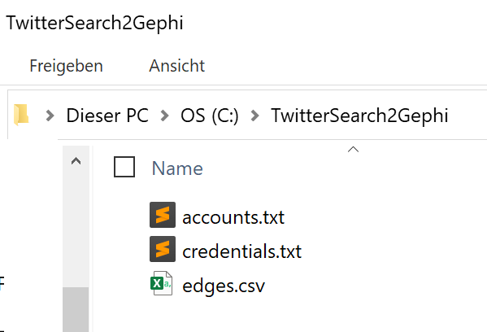
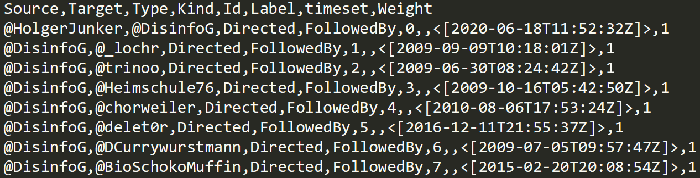
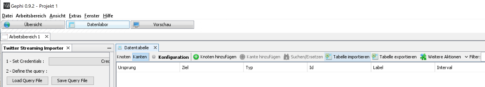
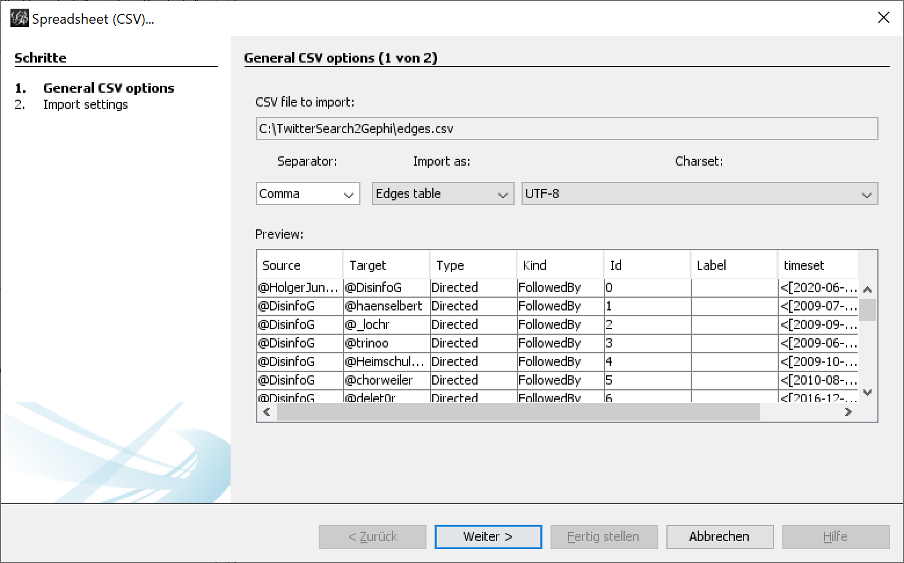
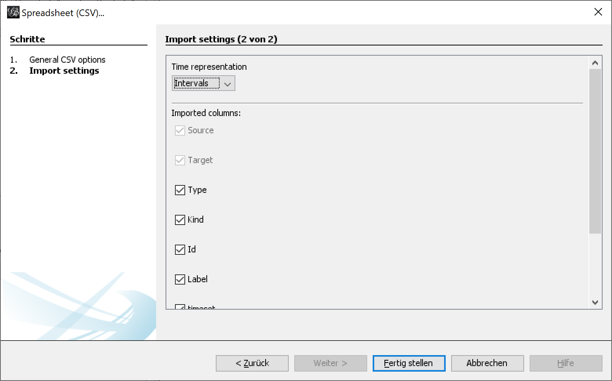
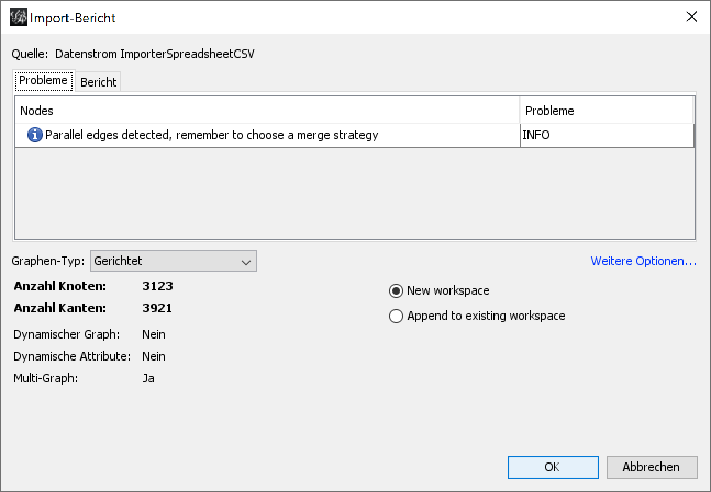
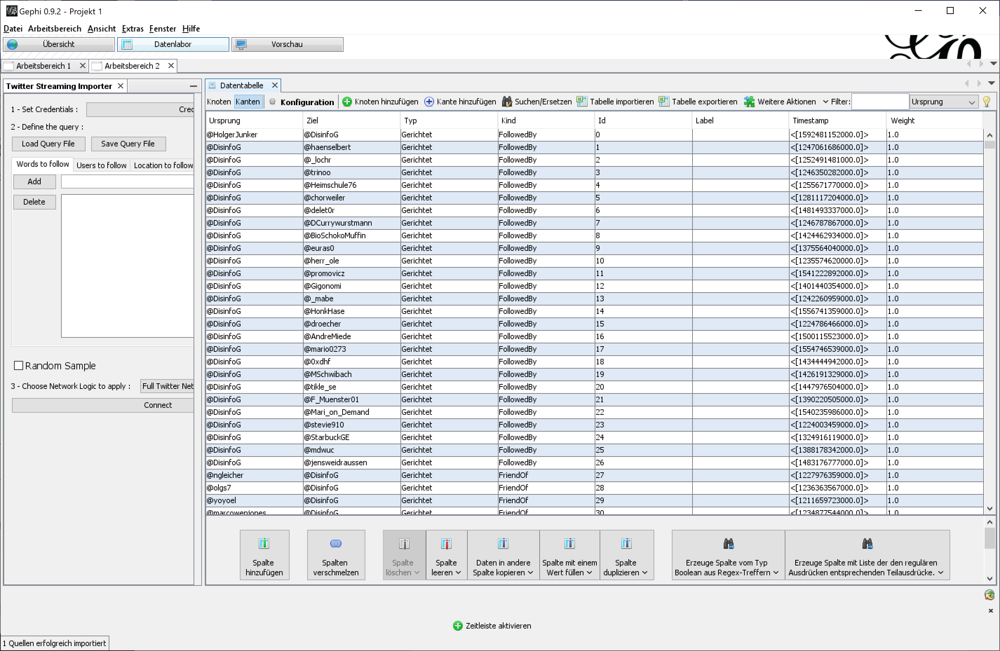
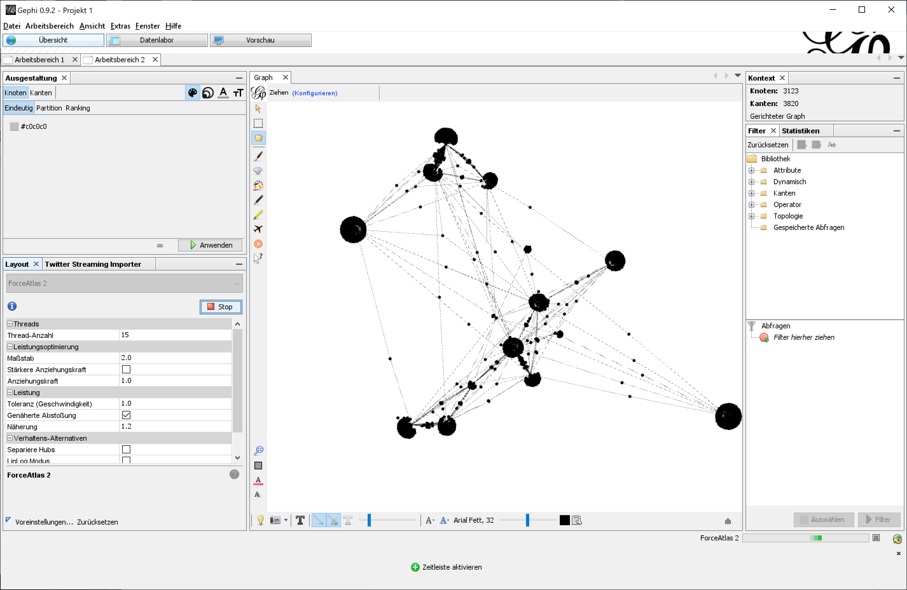

# TwitterSearch2Gephi
TwitterSearch2Gephi is a windows CLI app that lets you collect data from twitter via REST API and convert it into a CSV data set that can be used with Gephi.

Written by [@DisinfoG](https://twitter.com/DisinfoG)

## Installation
Download the [ZIP containing the binary and libs](https://github.com/hjunker/TwitterSearch2Gephi/blob/master/TwitterSearch2Gephi.zip) or use the source.

TwitterSearch2Gephi requires the folder C:\TwitterSearch2Gephi where it can read and write files.

The credentials for accessing the twitter REST API have to be placed in credentials.txt with one entry in each line for consumerKey, consumerSecret, userAccessToken, userAccessSecret in this order.
## Usage
TwitterSearch2Gephi takes the accounts (ScreenName) to look for from accounts.txt (one ScreenName per line without @). For each account it collects the following for generating engagements data.
*	Followers (default max. 250)
*	Friends (default max. 250)
*	Favorites (default max. 40)
*	Retweets

Please note that ‘engagements’ refers to accounts engaging with another account or their tweets. The data is collected from twitter’s standard REST API, _not_ the engagements API.

Data collection can be performed recursive. Therefore TwitterSearch2Gephi will ask you for an integer to chose a maxdepth other than the default which is set to 1 for one iteration. It will also ask you whether to write the findings to file or send it live to gephi's web interface.

The tool is invoked by double-clicking TwitterSearch2Gephi.exe or starting it from a cmd shell. The output is written to edges.csv which can be imported to Gephi.

Gephi should automatically recognize the data in edges.csv as an edges table.

The default import setting can be used.

In early versions of TwitterSearch2Gephi parallel edges can / will occur. Weighted edges might be included in later versions.

If everything works right you should see the data in the data lab view.

You can now visualize the data using the layouts you have installed in Gephi.

## TODOs
Some things are not implemented yet.
* fix some issues on rate limits (currently TwitterSearch2Gephi does not always get that it is above rate limits and therefore does not process any engagements aka is skipping accounts)
*	Correct implementation of the timeset parameter
*	Remove / avoid parallel edges by using weighted edges (when doing live feed to gephi's web interface)
*	Handling of special characters, emojis, etc.
*	…
## Contact
Feel free to give feedback or make feature requests here on GitHub or twitter (@DisinfoG / https://twitter.com/DisinfoG).

For services please refer to seculancer.de

## Contribute to TwitterSearch2Gephi
Please feel free to give a spare dime/dollar/euro/... or two... It will be used to further enhance my open source projects.

You can also support my projects by donating hardware and other stuff to keep operative backend and development systems running. Please take a look at (my list on, [amazon](https://www.amazon.de/hz/wishlist/ls/2FD1Z75K43I7M?ref_=wl_share))
